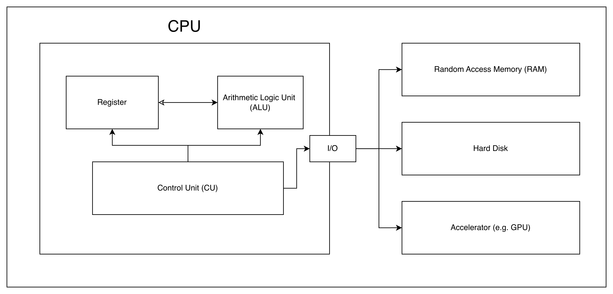
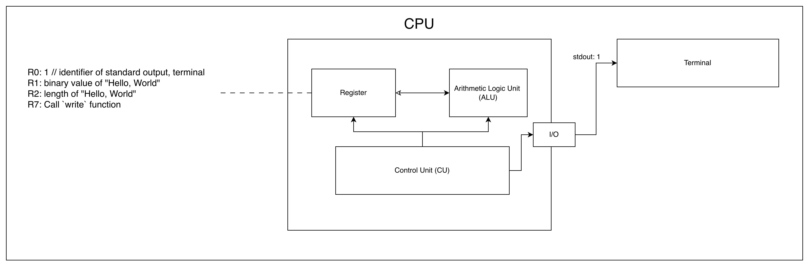
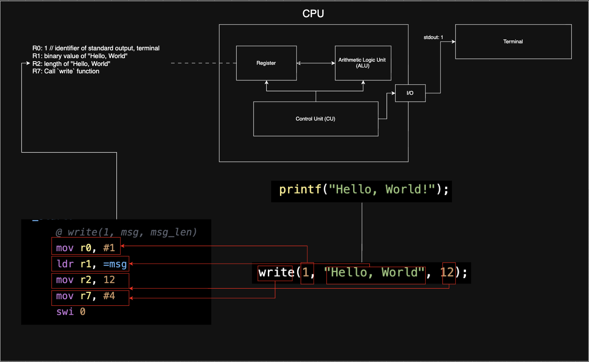

Programming language is human platform to control computer. From binary instruction to high-level language, Python, they are all packed together to faciliate human desire and economy-driven machine.

Though AI is emerging rapidly and some may think PL's user (i.g. Programmer) is dying, It's good idea to dig deeper into how computer and human collaborate toward same goal on PL's platform.

### Series Overview
This 4-5 episodes of series introduce you 
- the programming language
- How it does relate to lower-level CPU
- Why Python and its variant are exist
- What language virtual machine is
- Lower-level memory layout << Yes, we are talking about linear memory in CPU register and Random Access Memory (RAM)

I'll share my experience contributing to Python variant, SPy, to give you clear picture.

### Introduction to Programming Language

#### Modern Computer: CPU


Computer is million of transitor turn on/off to compute value. Every character, function, variable we write in program are **lowered** to low-level binary instruction (In simplified answer, Yes, it's `0101110` as you may imagine).

CPU is central unit to perform those calculation which compose of mathematical operation (ALU), memory to store data (register), and its controller (CU).

#### Binary / Assembly Language
Once upon a time, we directly [wrote binary instruction in hardware](https://computerhistory.org/blog/programming-the-eniac-an-example-of-why-computer-history-is-hard/) to compute numerical calculation. Next, scientist thought it's error-prune, hard to maintain, high learning curve. So, they make more readable human language-to-machine, [Assembly](https://www.computer.org/profiles/david-wheeler). 

Assembly is perceived as lower-language because it allow human to manipuate CPU closely.

[Arm 32] Assembly code to print "Hello, World" to terminal.
```Assembly
.section .data
msg:
    .ascii "Hello, World"

.section .text
.global _start

_start:
    @ write(1, msg, msg_len)
    mov r0, #1          
    ldr r1, =msg        
    mov r2, 12    
    mov r7, #4          
    swi 0               

    @ exit(0)
    mov r0, #0          
    mov r7, #1          
    swi 0
```

You don't need to understand below assembly code. We'll see its connection to higher-level language soon. Only please know below code perform "print `hello world` to terminal".



To print "Hello, World" to terminal, we need below value at the right place (register).

- `1` as standard output (stdout): the destination of data at `R0`. If target is difference, for example this `1` value will be changed to print text to file / light I/O.
- `"Hello, World"`: value to print, we store it at `R1` register.
- length of value: `12` length for `"Hello, World"` at `R2`
- `write` function syscall: `4` is `write` syscall at `R7`

Think of it like filling out a form before submitting it to the OS. Each register is a specific field: `R0` says where the output goes, `R1` points to what you want to print, `R2` tells how many bytes to send, and `R7` identifies the service you're requesting.

In our head, we need only "Hello, World" to display somewhere in our black screen. To do so in Assembly language, it require us to know;
- CPU register and its meaning (e.g. `R7` is register to hold `read, write, ...` I/O)
- "Hello, World" is ascii data type which must be converted to binary representation. For instance, `H` is `0x68` in hexadecimal / `01101000` in binary.
- In case we need to dynamically calculate **length of message** (used in `R2`), we need to perform length-calculating by ourselve. (Yes, Assembly doesn't has standard library like `sizeof(...)` in C or `len(...)` in Python).

We may have big question mark in our head. "So, what!? we don't write in Assembly anymore". Well, pleaes be with me a bit. We shall talk a bit of higher-level language, C language.

#### C Language

After years of Assembly, there were scientists at Bell Labs to facilitate human expression. Below is standard approach C code to print "Hello World" to terminal.

```C
#include <stdio.h>

int main() {
    printf("Hello, World!");
    return 0;
}
```

We can't see any relationship here because C language designer did very good job to **abstract** unnecessary stuff to print message to standard output, terminal. 

Behind the scene, `printf(...)`, standard library, measure length of message, set where to display message (`1` for terminal), call `write(...)` function to perform writing syscall to hardware.

Below C code operate same thing as `printf(...)` function above.

```C
#include <unistd.h>

int main() {
    write(1, "Hello, World", 12);
    return 0;
}
```

Now, we may seen some pattern between C and Assembly language. Let see below image for their connection.



C language is **lowered** to Assembly* and converted to binary instruction which CPU execute. Main difference is we don't need to care much of;
- which register to store value.
- which value is for `write` function
- no manual converion for data length to print

### Summary
Programming languages are the bridge between human intent and machine execution. This episode traces that journey — from transistors toggling binary states, to Assembly exposing CPU registers directly, to C abstracting those details into readable expressions. Each step raised the level of abstraction while hiding the underlying mechanics of registers, syscalls, and memory.

By following how a single `write(1, "Hello, World", 12)` call maps from C down to ARM Assembly registers (`R0`–`R7`), we see that every line of high-level code is ultimately *lowered* into binary instructions the CPU can execute. Future episodes build on this foundation to explore compilation pipelines, language virtual machines, and how Python — and its variant SPy — fit into this picture.

Next episode, we will talk about compilation pipeline in compiler,Python - higher-level dynamic language, and its internal.

